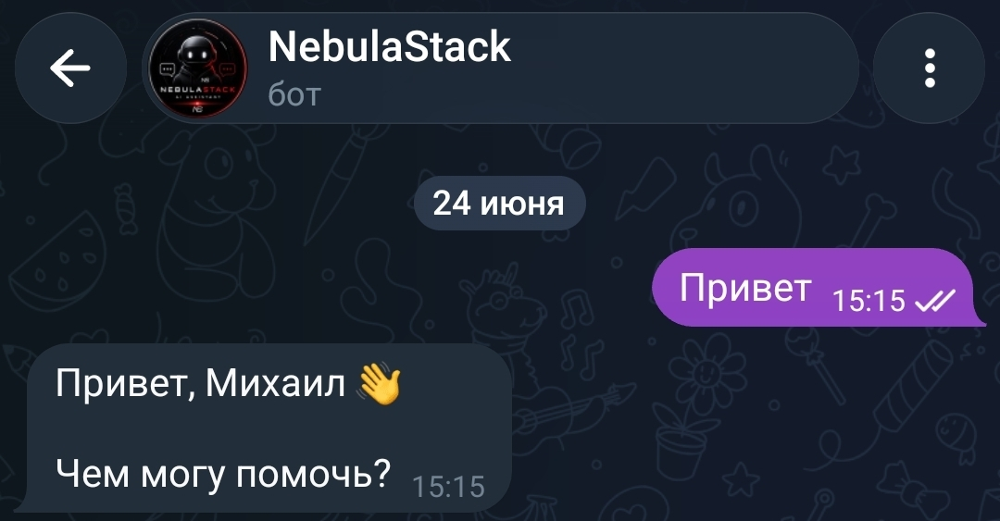
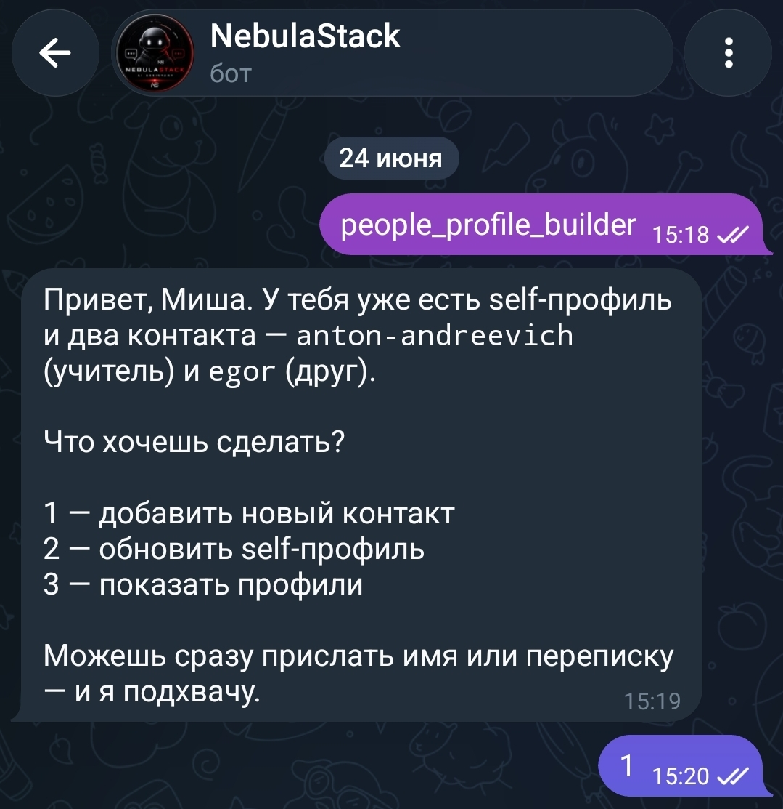
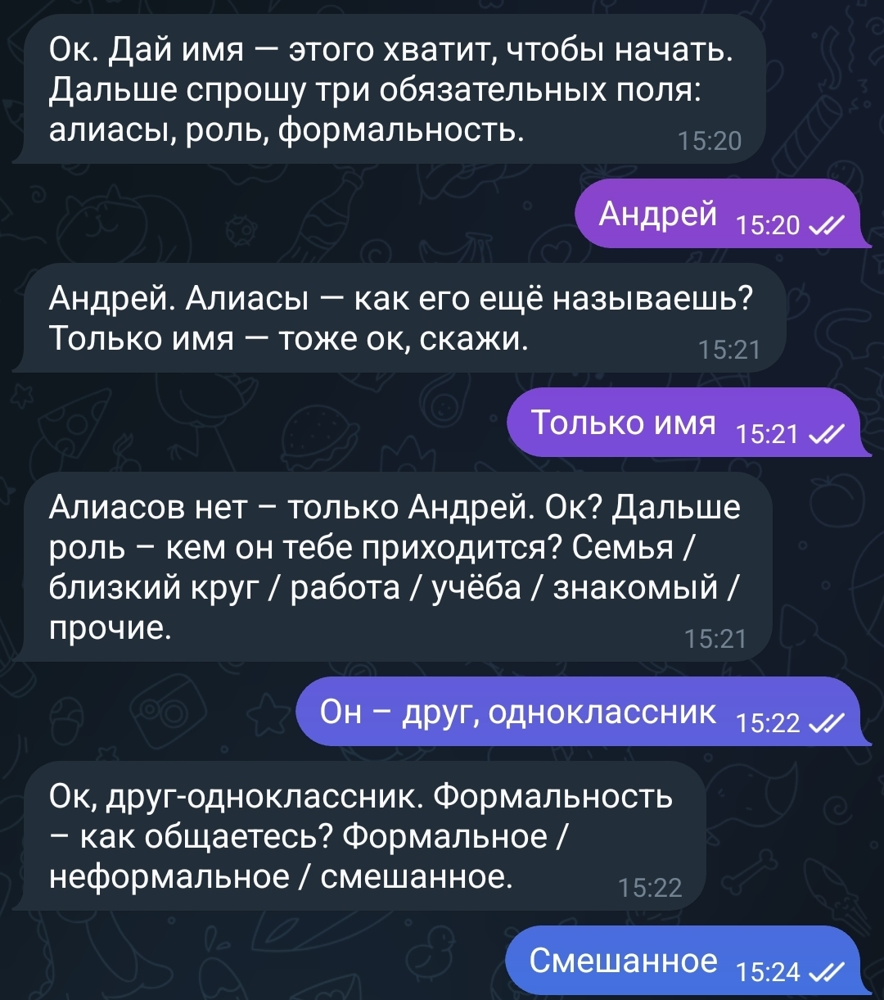
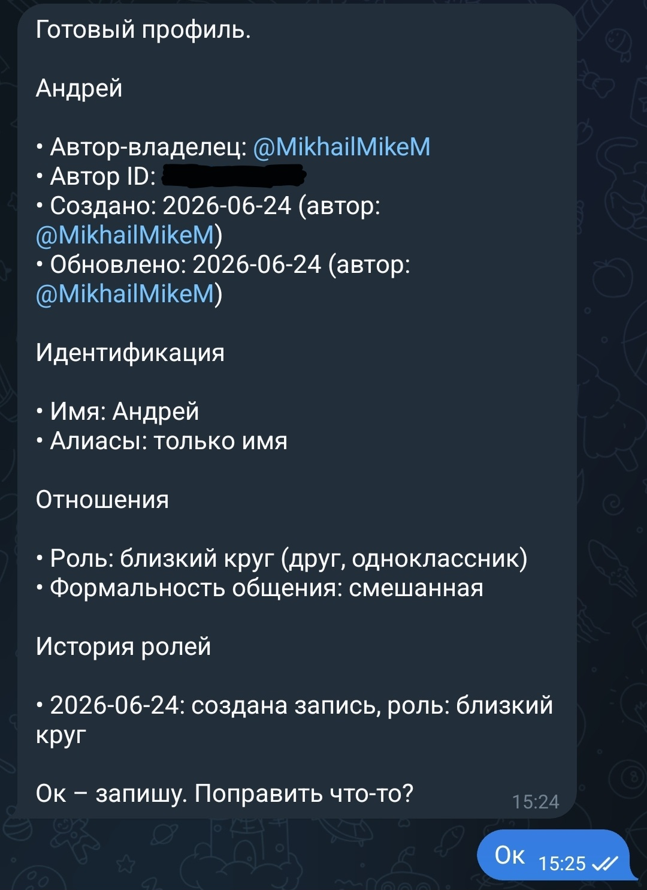
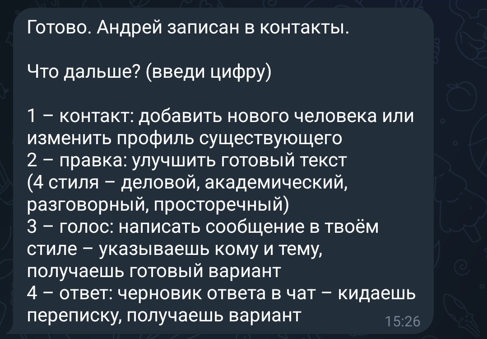
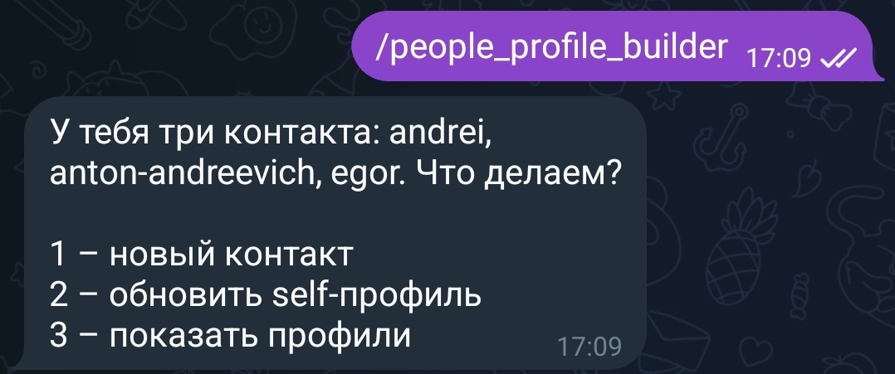
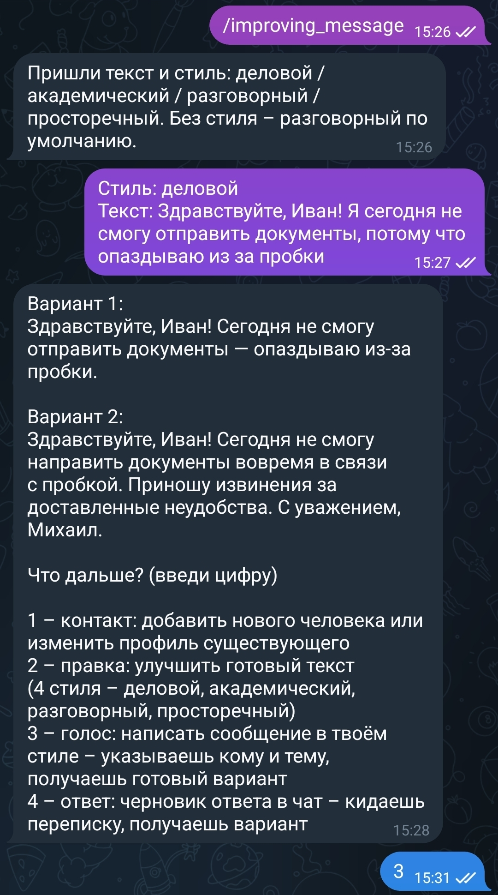
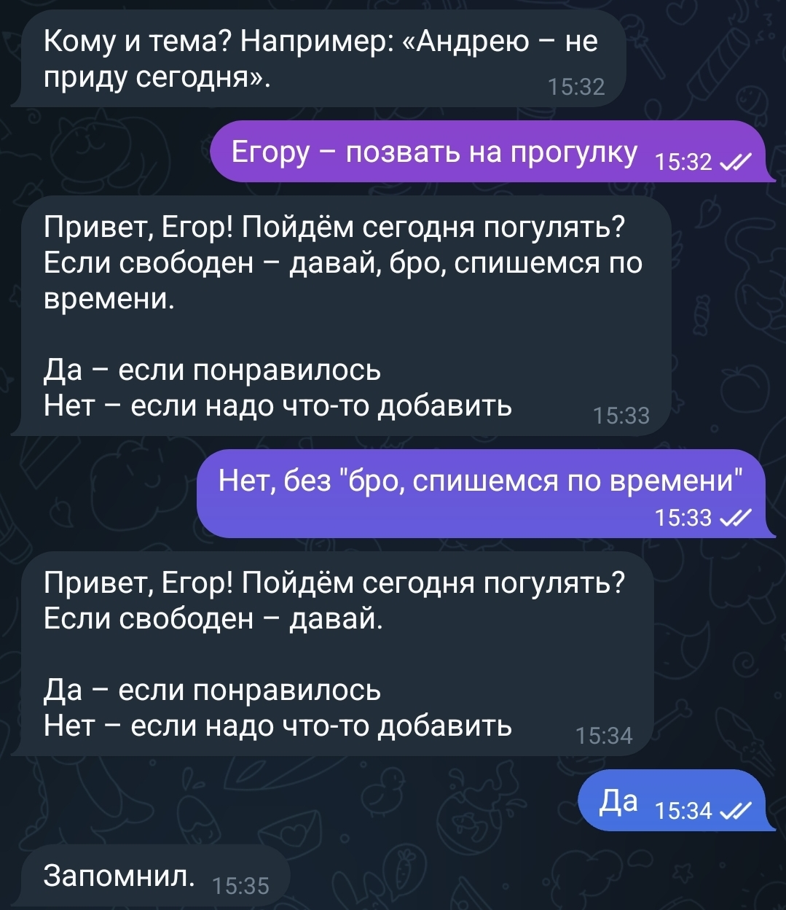
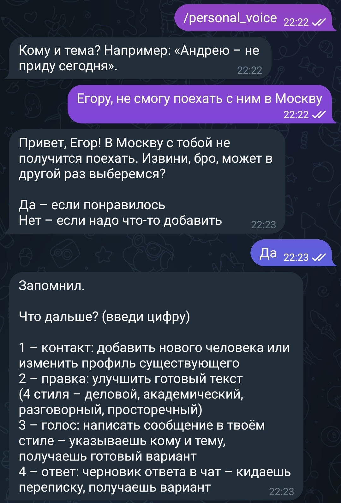

# Voice Assistant

> AI-powered assistant for writing and improving messages.

## 💻 Project Run

* Open with Telegram: @NebulaStackBot

## 📖 About

Every user can face a situation where a large number of messages arrive simultaneously from many different chats.

These can be work chats, conversations with family and friends, study communities, and other sources of communication.

Each reply may require taking into account the context of the conversation, the character and communication style of the other person, the user's own writing style for a particular chat, and many other details.

It can often be difficult to switch quickly between different chats, especially when a person is busy with other tasks or when a conversation becomes so active that it is difficult to keep track of the entire context without constant involvement.

To address this problem, the AI assistant **Voice Assistant** was created.

## 🎯 Project Goal

* Generate message replies based on the user's unique writing characteristics.

* Analyze a conversation or part of it and generate a context-aware reply.

* Help generate messages based on the specific recipient.

* Create a contact database for quick identification of communication styles.

* Generate messages while preserving the user's individual writing style and communication patterns with specific contacts.

## 🤖 Features

### 1. Skill `people_profile_builder`

Called with the command `/people_profile_builder`.

Creates a personal user profile based on their writing characteristics, as well as profiles for their contacts.

Contacts can be added and removed. Each contact includes a name used by the user, aliases (if any), general communication style, and additional parameters for more accurate generation.

As the assistant is used, it takes the user's corrections and preferences into account, allowing profiles to be gradually improved and making subsequent generations more accurate.

### 2. Skill `improving_message`

Called with the command `/improving_message`.

The user sends a message that needs to be improved. The assistant analyzes the text, identifies inaccuracies and errors, and creates an improved version.

Two message variants are generated, and the user chooses the most suitable one.

The selected variant and the user's preferences are taken into account in subsequent generations.

### 3. Skill `personal_voice`

Called with the command `/personal_voice`.

The user specifies the topic of the message, its recipient, and the required communication style: formal, informal, or mixed.

The assistant generates two message variants to choose from.

If necessary, the user can specify which elements should be changed, after which the assistant adjusts the generated message.

The selected variant is also taken into account for further improvement of the assistant's performance.

### 4. Skill `replyassistant`

Called with the command `/replyassistant`.

A conversation or part of it is provided as input.

The assistant analyzes the dialogue context and generates an appropriate reply.

User corrections and preferences are taken into account in subsequent interactions, allowing the accuracy of generation to gradually improve.

## 🧠 How It Works

The user sends a request through the Telegram bot.

The request is processed by **OpenClaw**, which passes it to the AI agent together with the required skill and relevant context.

In my case, **MiniMax** is used as the AI agent.

The agent analyzes the request, performs the necessary actions, and generates the result.

The result is then returned to OpenClaw and sent to the user through the Telegram bot.

Thus, OpenClaw acts as a connecting layer between the Telegram interface, AI agent, skills, and assistant logic.

## 🛠 Technology Stack

* OpenClaw

* MiniMax

* Telegram Bot API

* AI Agent Skills

© NESTIMS
